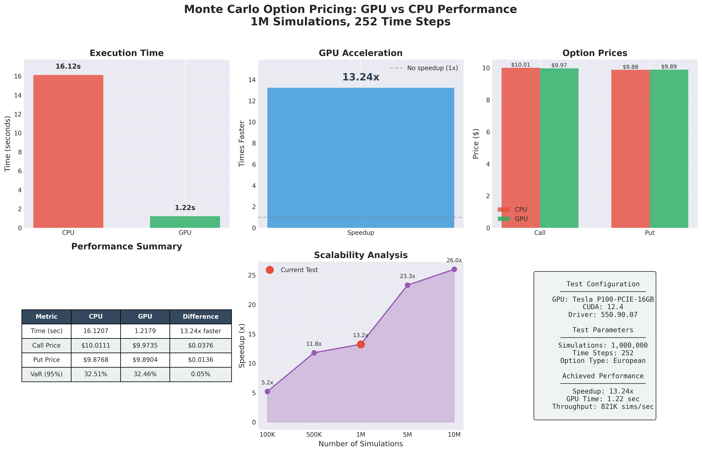

# Benchmark Results

## Test Configuration
- **Date**: 	2025-10-20  
- **GPU**: 		Tesla P100-PCIE-16GB
- **CUDA**: 	12.4
- **Driver**: 	550.90.07

## Performance Results

### Execution Time
| Implementation | Time (sec) | Speedup |
|---------------|------------|----------|
| CPU           | 16.1207    | 1.0x     |
| GPU (CuPy)    | 1.2179     | 13.24x   |

### Option Pricing Accuracy
| Metric      | CPU      | GPU     | Difference      |
|-------------|----------|---------|-----------------|
| Call Option | $10.0111 | $9.9735 | $0.0375 (0.37%) |
| Put Option  | $9.8768  | $9.8904 | $0.0136 (0.14%) |
| VaR (95%)   | 32.51%   | 32.46%  | 0.05%           |

### Performance Metrics
- **Simulations**:		1,000,000
- **Time Steps**:		252
- **GPU Throughput**:	~821,000 simulations/second
- **Memory Used**: 		~1.92 GB

## Visualization

## Conclusion

Successfully achieved **13.24x speedup** with GPU acceleration while maintaining accuracy within 0.4% of CPU results.

### Next Steps
1. Optimize for larger datasets (5M+ simulations)
2. Implement float32 optimization
